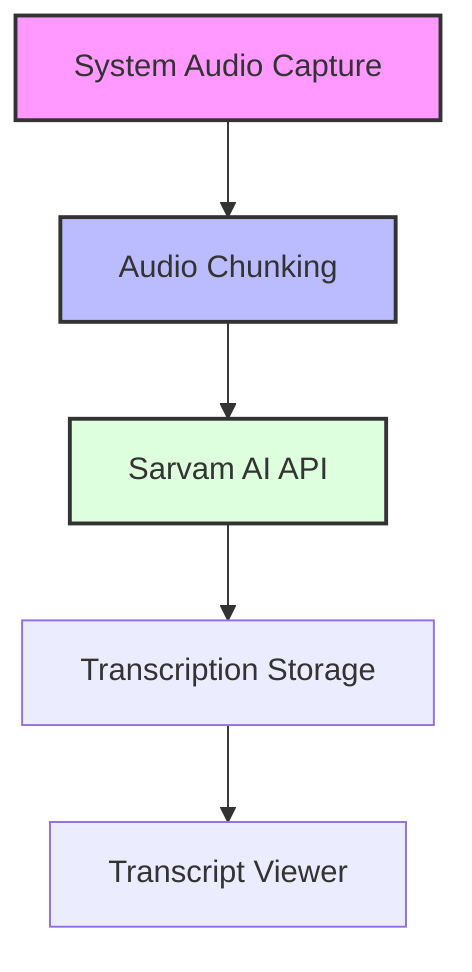

# Hindi Transcription Tool

A desktop application for transcribing Hindi audio from Slack huddles and browser calls, with a focus on system audio capture and integration with Sarvam AI for accurate Hindi transcription.

## Architecture


## Features
- System-level audio capture (Slack huddles & browser calls)
- Automatic 8-minute audio chunking
- Hindi transcription via Sarvam AI
- Local transcript storage
- Clean, native Mac interface

## Tech Stack
- Electron.js for desktop app
- React for UI
- Node.js for system audio capture
- Sarvam AI for Hindi transcription

## Development Setup
1. Install dependencies:
```bash
yarn install
```

2. Start development:
```bash
yarn dev
```

3. Build for production:
```bash
yarn build
```

## Project Structure
```
src/
  /electron       # Main electron process
  /frontend      # React frontend
  /backend       # Audio processing & API
  /shared        # Shared types & utils
```

## API Integration
- Sarvam AI Batch API for Hindi transcription
- 8-minute chunk processing
- Automatic chunking for long recordings (1-2 hours)

## Storage
- Local storage for transcripts
- JSON format for LLM compatibility
- Searchable transcript history

## Contributing
1. Fork the repository
2. Create feature branch
3. Submit pull request

## License
MIT</absolute_file_name>
</file>